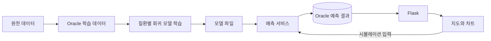

<div align="center">

# 서울시 호흡기 건강 예보

**대기환경, 인구, 과거 질환 데이터를 지역별 예측과 시각화로 연결한 웹 서비스**

[주요 기능](#주요-기능) &nbsp;&nbsp; [아키텍처](#아키텍처) &nbsp;&nbsp; [실행 안내](#실행-안내) &nbsp;&nbsp; [전체 프로젝트](../README.md)

</div>

<br>

## 프로젝트 소개

서울시 25개 자치구의 **감기와 천식 발생률과 예상 환자 수**를 당일부터 3일 후까지 비교하는 데이터 기반 웹 서비스입니다. 미세먼지, 기온, 인구 구성, 지역내총생산과 과거 질환 데이터를 피처로 구성하고, 모델의 예측 결과를 Oracle DB에 저장해 지도와 차트에 표시합니다.

데이터 수집과 모델 학습뿐 아니라 **예측 결과 재사용**, **사용자 입력 시뮬레이션**, **웹 서비스 연동**까지 구현했습니다.

## 주요 기능

- **지역별 예측**: 25개 자치구, 감기와 천식, D0~D+3의 발생률, 환자 수 조회
- **시각화**: GeoJSON 기반 지역 지도와 과거 및 예측 데이터 차트
- **조건 시뮬레이션**: 미세먼지 평균, 과거 환자 수, 기온 차, 인구 비율 등을 변경해 결과 비교
- **데이터 파이프라인**: 대기질, 인구, 지역경제, 질환, 검색 추이 수집 및 학습용 테이블 구성
- **모델 비교**: Random Forest, XGBoost, LightGBM 학습 코드와 질환별 모델 저장
- **웹 기능**: 회원가입과 로그인, 질문과 답변 게시판, PreDect, 튜터 화면 연결

## 기술 스택

- **Web**: Python, Flask, Jinja2, Bootstrap (웹 요청 처리와 화면 구성)
- **Data**: Oracle DB, SQLAlchemy, python-oracledb (원천, 학습, 예측 데이터 저장 및 조회)
- **ML**: scikit-learn, XGBoost, LightGBM, joblib (다중 출력 회귀, 모델 비교, 저장, 로딩)
- **Processing**: pandas, NumPy, holidays (피처 구성, 인구 기준 정규화, 휴일 처리)
- **Forms**: Flask-WTF, WTForms (입력 폼 및 CSRF 처리)

## 아키텍처



- `DB/`: 수집과 적재 스크립트
- `ML/`: 피처 구성용 SQL과 모델별 학습 코드
- `flask/air/ml/`: 검색 추이 기반 보조 예측과 최종 예측 처리
- `flask/air/utils/model_utils.py`: 저장 결과 확인과 재사용, 재예측, 시뮬레이션
- `flask/air/views/service_views.py`: 지도 데이터와 서비스, 시뮬레이션 요청 처리

## 구현 포인트

### 서로 다른 인구 규모를 비교하는 예측

XGBoost 학습 코드에서는 환자 수와 과거 환자 수 피처를 **인구 1만 명당 비율**로 변환합니다. `MultiOutputRegressor`로 D0~D+3의 네 출력을 학습하고, 서비스에서는 예측 발생률을 지역 인구에 맞춰 환자 수로 환산합니다.

### 시간 순서와 피처 구성

`ML/XGBoost/train_xgb.py`는 날짜, 자치구 순으로 정렬한 데이터 중 2020년 이전 자료를 사용하고, 앞 80%와 뒤 20%를 학습과 평가로 나눕니다. 타깃과 직접 연결된 환자 수, 발생률 컬럼은 입력에서 제외합니다. 미세먼지 이동평균, 과거 질환 정보, 인구 구조와 휴일 정보를 활용합니다.

### 예측 결과 재사용

당일 저장 데이터에 **질환별 25개 구 × 4일 = 100개 조합**이 있는지 확인하고, 부족할 때 예측을 실행합니다. 조회 화면은 저장된 결과를 다시 사용하며, 조건 시뮬레이션은 별도의 모델 호출로 처리합니다.

## 주요 경로

- `GET /service/`: 예측 지도와 차트 화면
- `GET /service/seoul-geo`: 서울시 자치구 GeoJSON
- `POST /service/simulate`: 입력 조건을 반영한 네 시점 예측
- `GET /PreDect`: 별도 영상 API와 연결하는 화면
- `GET /llm/tutor`: 별도 LLM API와 연결하는 화면

## 실행 안내

### 준비 사항

- Python 환경과 Oracle DB, 연결에 필요한 Oracle 클라이언트 설정
- 코드에서 사용하는 Flask, SQLAlchemy, ML 관련 패키지
- `DB/`, `ML/SQL/` 기준의 테이블과 원천 데이터 및 학습용 `TRAIN_SET`
- `flask/air/ml/model_asthma_seoul.pkl`, `model_cold_seoul.pkl`과 보조 모델 산출물

이 폴더에는 통합 `requirements.txt`와 학습된 `.pkl` 파일이 포함되어 있지 않습니다. `.pkl`은 저장소의 `.gitignore` 대상입니다. DB 연결은 `flask/config.py`, `ML/db_config.py` 및 실행할 수집, 예측 스크립트의 설정을 확인해 로컬 환경에 맞게 준비합니다.

### 실행 순서

1. DB 스키마와 원천 데이터를 준비하고 `ML/SQL/`의 학습 데이터 구성을 확인합니다.
2. 학습 코드의 경로, import 설정을 맞춘 뒤 질환별 모델을 생성하고 위 위치에 배치합니다.
3. 이 프로젝트의 `flask` 폴더에서 웹 앱을 실행합니다.

```powershell
python -m flask --app air:create_app run --port 5001
```

`http://127.0.0.1:5001/service/`에서 예측 화면을 확인합니다. `5001`은 LLM API의 기본 포트 `5000`과 함께 실행할 때 충돌을 피하기 위한 예시입니다. PreDect, 튜터 화면까지 사용하려면 해당 API를 별도로 실행하고 화면에 지정된 서버 주소를 수정해야 합니다.

## 결과 해석

지역별 발생률과 환자 수를 비교하는 실험용 예측 서비스입니다. 개인의 질병 발생 확률을 검증한 모델은 아니며, 시뮬레이션에는 기본값으로 고정된 입력 피처도 포함됩니다. 모델 평가 점수는 실제 학습과 검증 결과로 확인해야 하며, 이 문서에는 재현하지 않은 성능 수치를 기재하지 않았습니다.

[← 전체 프로젝트](../README.md)
