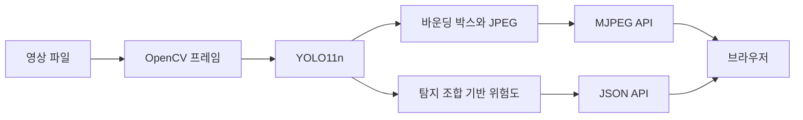

<div align="center">

# PreDect

**보행 신호와 주변 객체를 탐지하고 영상과 위험도 API로 제공하는 컴퓨터비전 프로젝트**

Pre + Detect, 2026.04–2026.05

[주요 기능](#주요-기능) &nbsp;&nbsp; [학습과 검증](#학습과-검증) &nbsp;&nbsp; [전체 프로젝트](../README.md)

</div>

<br>

## 프로젝트 소개

PreDect는 보행 환경의 영상에서 **빨간불과 녹색불 보행 신호, 사람, 차량, 공 등**을 인식하고, 탐지 결과를 웹 서비스로 전달하는 프로젝트입니다. YOLO11n 학습부터 라벨 검수, OpenVINO 변환, Flask API까지 연결했습니다.

특히 원거리 보행자용 신호등이 누락되는 문제를 분석하고, **고해상도 원본 데이터 확보와 자동 라벨 후보 생성과 사람 검수**를 통해 학습 데이터를 개선했습니다.

## 주요 기능

- **데이터 구축**: 신호등 전용 Labeler와 COCO 모델로 후보 라벨 생성 후 오탐과 누락 검수
- **모델 학습**: YOLO11n fine-tuning과 전체 및 클래스별 검증 지표 확인
- **영상 처리**: OpenCV 프레임 처리, 바운딩 박스 시각화, JPEG 인코딩
- **API**: MJPEG 영상 스트림, 최신 탐지 객체, 위험도 JSON, Swagger UI
- **추론 변환**: 학습 노트북에서 OpenVINO FP32 고정 입력 모델로 내보내기

## 기술 스택

- **Detection**: Ultralytics YOLO11n (보행 신호, 주변 객체 학습과 탐지)
- **Dataset**: Roboflow (객체 탐지 데이터셋 구성과 관리)
- **Video**: OpenCV (프레임 입력, 주석 영상, MJPEG 스트리밍)
- **Inference**: OpenVINO (FP32 모델 변환 및 별도 추론 실험)
- **API**: Python, Flask, Flask-RESTX, Flask-CORS (영상, 상태 제공과 API 문서)
- **Training**: PyTorch, CUDA, Jupyter (GPU 학습과 평가 노트북)

## 아키텍처



현재 Flask API는 `PreDect.pt`를 직접 로드합니다. **OpenVINO 변환 실험과 Flask의 PyTorch 가중치 추론은 별도 경로**입니다.

## 학습과 검증

### 소형 객체를 위한 데이터 개선

- 1080p 원본 프레임에서 신호등 전용 Labeler, COCO 모델로 라벨 후보 생성
- 사람이 오탐과 누락을 검수한 데이터만 최종 학습에 반영
- 최종 학습 입력은 `imgsz=640`; **1080p 원본 이미지와 모델 입력 해상도를 구분**
- `mosaic=0.1`, `scale=0.0`, `mixup=0.0` 등으로 객체 크기와 형태 변형을 조절

### 저장된 최종 검증 결과

`notebooks/YOLOv11n.ipynb`의 `best.pt` 검증 로그 기준입니다. 150 epochs를 상한으로 설정했고 136 epochs에서 조기 종료되었으며, best epoch는 106입니다. 검증 데이터는 **121장, 397개 객체**입니다.

- 전체 Precision: 0.935
- 전체 Recall: 0.721
- 전체 mAP50: 0.813
- 전체 mAP50–95: 0.547
- 녹색 보행 신호 `ped_g` mAP50: 0.900
- 빨간 보행 신호 `ped_r` mAP50: 0.912

`0.912`는 빨간 보행 신호 클래스의 mAP50이며 전체 모델의 정확도가 아닙니다. 데이터 구성에는 `traffic_light`를 포함한 6개 클래스가 사용되지만, 저장된 최종 검증 로그에 개별 지표가 표시된 클래스는 5개입니다. `traffic_light` 성능을 별도로 입증한 수치로 해석하지 않습니다.

## 위험도 계산

프레임 내 `person`과 `sports_ball`의 존재 여부에 따라 고정 가정값을 베이즈 식에 대입합니다.

- 사람 없음: `0.0`
- 사람만 있음: 사전확률 `0.1`
- 사람과 공이 함께 있음: `(0.8 × 0.1) / (0.8 × 0.1 + 0.3 × 0.9) ≈ 0.229`

사람이 실제로 공을 들고 있는지, 도로로 진입하는지를 추적하는 로직은 아닙니다. 신호등 색상도 이 계산식에는 들어가지 않습니다. 이 값은 **탐지 조합에 기반한 데모 지표**이며 실제 사고 확률을 검증한 결과와 구분합니다.

## 프로젝트 구조

```text
2차 Project(Computer Vision)/
├─ __init__.py             # Flask API, 영상 처리, 위험도 계산
├─ PreDect.pt              # API가 로드하는 탐지 가중치
├─ clip_ball.mp4           # 기본 입력 영상
├─ clip_original.mp4       # 예제 영상
└─ notebooks/
   ├─ labeler.ipynb        # 보행 신호 Labeler 학습
   └─ YOLOv11n.ipynb       # 최종 학습과 검증, OpenVINO 내보내기
```

[← 전체 프로젝트](../README.md)
