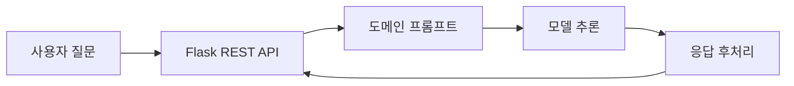

# Unity/GameDev LLM Tutor

**Unity, 게임개발, 게임수학 질문을 위한 도메인 특화 LLM 챗봇**

**핵심 기술:** Python, Llama 3.2 3B, QLoRA, SFT, Instruction Tuning, Domain Fine-Tuning, AWQ, Flask-RESTX

[주요 기능](#-주요-기능) &nbsp;&nbsp; [데이터셋](#-데이터셋) &nbsp;&nbsp; [아키텍처](#-아키텍처) &nbsp;&nbsp; [전체 프로젝트](../README.md)

 

## 📌 프로젝트 소개

Unity 학습자가 한국어로 개념과 구현 방법을 질문할 수 있는 LLM Tutor입니다. **Llama 3.2 3B**에 KoAlpaca 기반 instruction tuning과 Unity/GameDev 도메인 fine-tuning을 적용하고, 모델의 답변을 웹 화면으로 전달하는 Flask REST API를 구현했습니다.

답변이 불필요하게 길어지거나 학습용 구분자를 다시 출력하는 문제를 줄이기 위해 **도메인 프롬프트, stop sequence, 중복 제거와 길이 제한**을 함께 적용했습니다.

## ✨ 주요 기능

- **한국어 튜터**: Unity, C#, 게임개발, 게임수학 질문과 답변
- **Instruction Tuning**: KoAlpaca instruction dataset으로 한국어 지시문과 응답 형식 학습
- **Domain Fine-Tuning**: Unity/GameDev 전문 지식과 일반 대화 데이터를 활용한 추가 학습
- **REST API**: 질문 입력 검증, 응답 포맷, 상태 확인
- **응답 제어**: 학습 구분자 제거, 중복 문장 제거, 코드 요청 여부에 따른 출력 제어
- **연결 처리**: 추론 서버 주소, 모델, 키 설정, 타임아웃, 연결 오류 메시지

## 🛠️ 기술 스택

- **Base Model**: Llama 3.2 3B (`meta-llama/Llama-3.2-3B`)
- **Training**: QLoRA, SFT (Supervised Fine-Tuning), TRL SFTTrainer, PEFT
- **학습 단계**: KoAlpaca Instruction Tuning, Unity/GameDev Domain Fine-Tuning
- **Quantization**: AWQ 4-bit (학습 후 추론용 모델 경량화)
- **API**: Python, Flask, Flask-RESTX, Flask-CORS (입력 검증과 JSON 응답)
- **Dataset**: JSONL, KoAlpaca instruction data (한국어 지시문과 답변 구성)

KoAlpaca로 instruction tuning한 모델에 LoRA adapter를 병합한 뒤, 이를 Unity/GameDev 도메인 fine-tuning의 시작 모델로 사용했습니다. 두 학습 단계 모두 TRL의 `SFTTrainer`로 SFT를 수행했으며, 4-bit QLoRA를 적용했습니다.

SFT는 정답 응답을 학습하는 방식이고, QLoRA는 4-bit로 양자화한 base model에 LoRA adapter를 학습하는 기법입니다. 최종 adapter를 병합한 뒤에는 AWQ 4-bit 양자화를 적용해 추론용 모델을 경량화했습니다.

이 저장소에는 데이터셋과 서비스 연결 코드가 포함되어 있으며, fine-tuning 학습 노트북과 최종 LLM 가중치는 포함되어 있지 않습니다.

## 🗂️ 데이터셋

- Unity, 게임개발, 게임수학 전문 지식: 6,290개 (약 86.3%)
- 일반 대화 및 지시: 1,000개 (약 13.7%)
- **합계**: **7,290**개 (**100%**)

저장소의 JSONL, JSON 파일을 직접 집계한 수치입니다. 전문 지식과 일반 데이터는 각 레코드의 `data_type`으로 구분합니다.

- 학습 형식: `instruction`, `input`, `output`
- 학습 파일: `unity_game_dev_tutor_dataset/unity_game_dev_tutor_ko.jsonl`
- JSON 배열 버전과 [데이터 설명](./unity_game_dev_tutor_dataset/README.md), [출처 문서](./unity_game_dev_tutor_dataset/SOURCES.md) 포함
- 오브젝트 풀링, Update/FixedUpdate, Rigidbody/CharacterController, Collider/Trigger 등 핵심 개념의 한국어 질문 변형 구성
- 비코드 질문의 코드블록과 반복, 메타 문구를 정리하고 간결한 답변 형식으로 구성

## 🏗️ 아키텍처

## 💡 구현 포인트

### 출력 형식의 일관성

- 한국어 도메인 프롬프트로 답변 범위와 용어 사용 지시
- stop sequence와 후처리로 `### 입력:`, `### 응답:` 등 구분자의 재출력 정리
- 동일 문장을 제거하고 일반 질문은 최대 3개, 코드 요청은 최대 5개 문장 단위로 후처리
- 코드, C#, 구현, 스크립트를 명시한 요청에서만 코드블록 허용

이 설정은 출력 제어를 위한 구현이며 답변 정확도나 코드의 실행 가능성을 보장하는 평가 결과는 아닙니다.

## 🔗 주요 API

- HTTP `GET /health`: Flask API 상태 확인
- HTTP `POST /chat`: `question`을 받아 `status`, `answer`, `via` 반환

[← 전체 프로젝트](../README.md)
